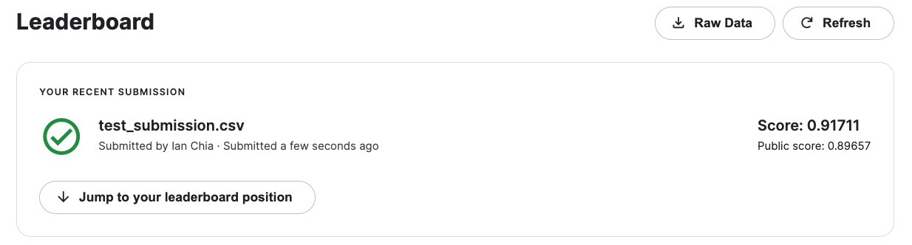
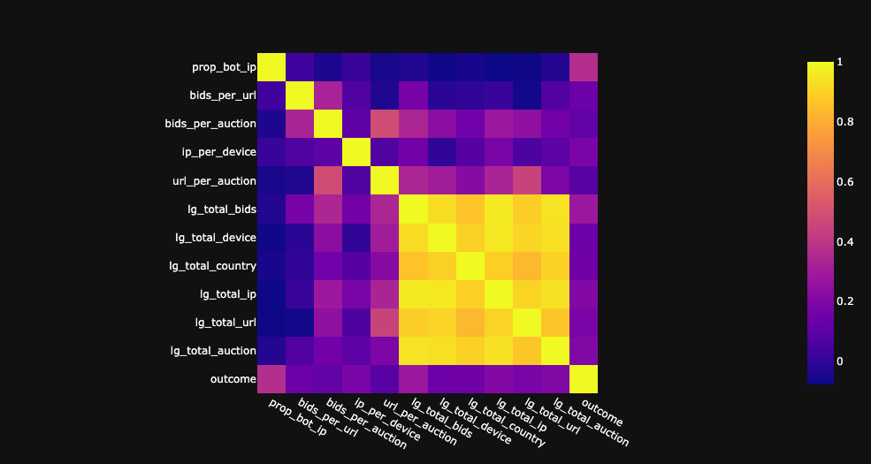

<!-- PROJECT LOGO -->

  <h2>Facebook Recruiting IV: Human or Robot?</h2>
  
Predict if an online bid is made by a machine or a human

  

 

<!-- TABLE OF CONTENTS -->

  
Table of Contents

  <ol>
    <li>
      <a href="#about-the-project">About The Project</a>
      <ul>
        <li><a href="#file-description">File Description</a></li>
        <li><a href="#data-description">Data Description</a></li>
        <li><a href="#data-fields">Data Fields</a></li>
        <li><a href="#scoring">Scoring</a></li>
      </ul>
    </li>
    <li>
      <a href="#exploratory-data-analysis">Exploratory Data Analysis</a>
      <ul>
        <li><a href="#correlation-matrix">Correlation Matrix</a></li>
        <li><a href="#fishers-score">Fisher's Score</a></li>
      </ul>
    </li>
    <li>
      <a href="#model-development">Model Development</a>
      <ul>
        <li><a href="#features-used">Features Used</a></li>
        <li><a href="#models-used">Models Used</a></li>
      </ul>
    </li>
  </ol>

<!-- ABOUT THE PROJECT -->
## About The Project

### File Description
* `train.csv` the training set from the bidder dataset
* `test.csv` the test set from the bidder dataset
* `bids.csv` the bid dataset

(<a href="#top">back to top</a>)

### Data Description
* There are two datasets in this competition. One is a bidder dataset that includes a list of bidder information, including their id, payment account, and address. The other is a bid dataset that includes 7.6 million bids on different auctions. The bids in this dataset are all made by mobile devices.
* The online auction platform has a fixed increment of dollar amount for each bid, so it doesn't include an amount for each bid. You are welcome to learn the bidding behavior from the time of the bids, the auction, or the device. 

(<a href="#top">back to top</a>)

### Data Fields
For the bidder dataset
* `bidder_id` Unique identifier of a bidder.
* `payment_account` Payment account associated with a bidder. These are obfuscated to protect privacy. 
* `address` Mailing address of a bidder. These are obfuscated to protect privacy. 
* `outcome` Label of a bidder indicating whether or not it is a robot. Value 1.0 indicates a robot, where value 0.0 indicates human. 

For the bid dataset
* `bid_id` Unique id for this bid
* `bidder_id` Unique identifier of a bidder (same as the bidder_id used in train.csv and test.csv)
* `auction` Unique identifier of an auction
* `merchandise` The category of the auction site campaign, which means the bidder might come to this site by way of searching for "home goods" but ended up bidding for "sporting goods" - and that leads to this field being "home goods". This categorical field could be a search term, or online advertisement. 
* `device` Phone model of a visitor
* `time` Time that the bid is made (transformed to protect privacy).
* `country` The country that the IP belongs to
* `ip` IP address of a bidder (obfuscated to protect privacy).
* `url` URL where the bidder was referred from (obfuscated to protect privacy). 

(<a href="#top">back to top</a>)

### Scoring
* Scored on AUC which is the area under an ROC (Receiver Operating Characteristics) curve; aggregates the performance of the model at all threshold values

(<a href="#top">back to top</a>)

## Exploratory Data Analysis

### Correlation Matrix
* measure of the linear relationship between 2 or more variables

  

(<a href="#top">back to top</a>)

### Fisher's Score
* find a subset of features, such that in the data space spanned by the selected features, the distances between data points in different classes are as large as possible, while the distances between data points in the same class are as small as possible

  

> Ranks of the variables based on fisher’s score in descending order

(<a href="#top">back to top</a>)

## Model Development

### Features Used
* bids_per_url - mean number of bids made per URL
* bids_per_auction - mean number of bids made per auction
* ip_per_device - mean number of IPs used for every device a bidder used
* url_per_auction - mean number of URLs used per auction
* lg_total_bids - log transformation of the total number of bids made by a bidder
* lg_total_device - log transformation of the total number of devices used by a bidder
* lg_total_country - log transformation of the total number of country an IP belongs to
* lg_total_ip - log transformation of the total number of IPs used
* lg_total_url - log transformation of the total number of URLs used
* lg_total_auction - log transformation of the total number of auctions a bidder joined

### Models Used
Used an ensemble of 
* Random Forest Classifier
* CatBoost Classifier
* Gradient Boosting Classifier

Performed hyperparameter tuning using GridSearchCV, and model training using k-FoldCV

(<a href="#top">back to top</a>)

